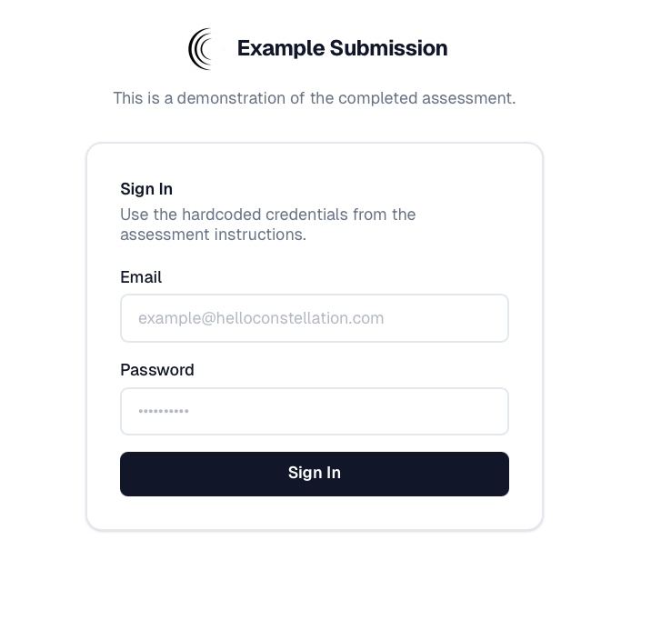
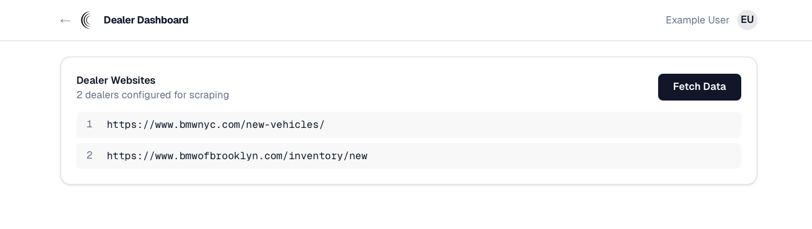
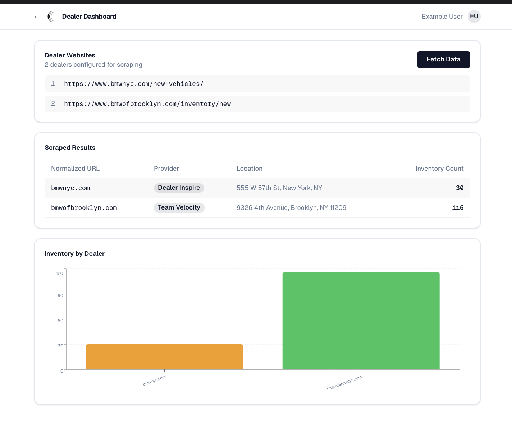

# AI Tigers - AI Solutions Analyst Assessment

Welcome to the AI Tigers engineering assessment! We are excited to see your skills in action. 

This assessment is designed to test a variety of practical engineering skills you will use day-to-day as an AI Solutions Analyst, including web scraping, basic data analysis, and version control. 

**Note on UI/UX:** This demo is judged purely on functionality. Do not spend time polishing the UI. We are looking for robust backend logic, data extraction, and problem-solving. Everyone knows engineers don’t need UI/UX skills anyway! 😀

---

## 📋 The Task

Your goal is to build a web application using **TypeScript, React, and Next.js** that runs locally on `localhost:3000`. 

The application will feature a basic hardcoded authentication layer, display a specific list of automotive dealer websites, and include a data-fetching engine that scrapes and analyzes live inventory data from those sites, displaying the results in a table and a chart.

---

## 🛠️ Technical Requirements & Constraints

* **Tech Stack:** TypeScript, React, Next.js.
* **Package Manager:** Must use `pnpm`.
* **Zero-Config Execution:** The reviewer must be able to test your application simply by running `pnpm i && pnpm run dev`. 
    * *Important:* The reviewer will **not** configure any `.env` credentials. If your application requires any external keys for the scraping logic, please commit a `.env` file with test credentials for this exercise, or hardcode them. (We know this is bad practice in production, but it is required for this frictionless review process).
* **No AI APIs:** The parsing and scraping logic **cannot** be done using an AI API key (e.g., passing the HTML to OpenAI). You must use programmatic extraction (DOM parsing, Regex, etc.).

---

## 🔑 Features to Implement

### 1. Authentication
* Implement a simple authentication screen.
* The system must allow a user to log in using **only** these exact hardcoded credentials:
    * **Email:** `example@helloconstellation.com`
    * **Password:** `ConstellationInterview123!`
* Once successfully logged in, the application must display the user’s name (e.g., "Example User") at the top right of the page.

### 2. Dealer Dashboard & Fetching
Display the following list of auto dealer URLs. Next to this list, provide a single button labeled **"Fetch Data"**.

**List of Dealers to Scrape:**
1. "https://www.bmwnyc.com/new-vehicles/",
2. "https://www.bmwofbrooklyn.com/inventory/new"

### 3. Data Parsing & Table Output
When the user clicks "Fetch Data", the application must parse the "new inventory" or "specials" page of each dealer website. The output should be displayed in a table with the following columns:

1.  **Normalized Dealer URL:** Convert specialized paths to the root domain. 
    * *Example:* `www.example5.com/path5/inventory` → `example.com`
2.  **Website Provider:** Detect and output which of the 5 main auto dealership website providers powers the site:
    * Dealer.com
    * DealerOn
    * Dealer Inspire
    * Dealer eProcess
    * Team Velocity
3.  **Geographic Location:** Extract the physical location/city of the dealership from the page.
4.  **Inventory Count:** Fetch the live count of vehicles in their inventory.

### 4. Data Visualization
Below the table, render a simple chart visualizing the extracted data.
* **Y-Axis:** Count of Inventory
* **X-Axis:** Dealer Name (or Normalized URL)
---

## 💡 Hints & Challenges

* **Dynamic Content:** On the dealer inventory/specials pages, the inventory count is often dynamically loaded and updated via JavaScript. You will likely not find this in the initial static HTML.
    * *Hint:* This might require implementing a headless browser (like Puppeteer or Playwright) to wait for the page to fully render.
* **Bot Mitigation:** Browsers and servers generally do not want you to scrape their inventory. 
    * *Hint:* You might need to implement strategies to avoid Cloudflare blocks, DNS blocks, or basic bot-detection mechanisms.

---

## 🚀 Getting Started & Submission

1.  **Fork this repository** to your personal GitHub account.
2.  Clone your fork locally.
3.  Build out your solution according to the requirements above.
4.  Test your application locally to ensure `pnpm i && pnpm run dev` works perfectly without any additional reviewer setup.
5.  **Submit** by providing the link to your public forked repository in your initial application link.

Good luck! We look forward to seeing your solution.